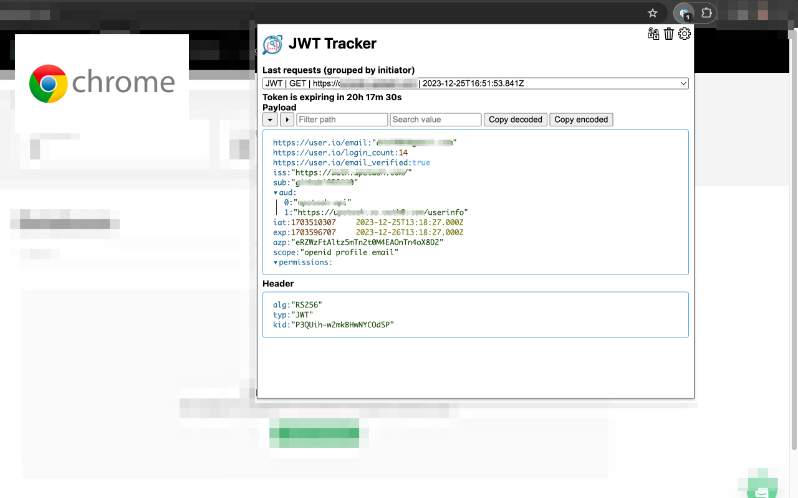
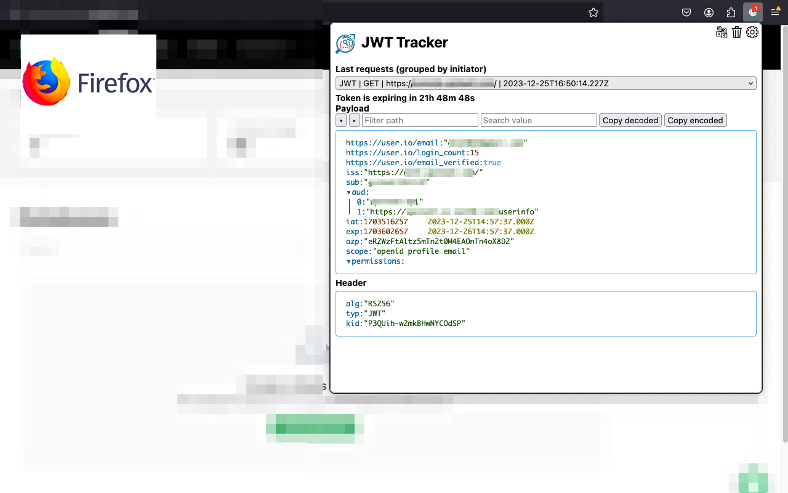
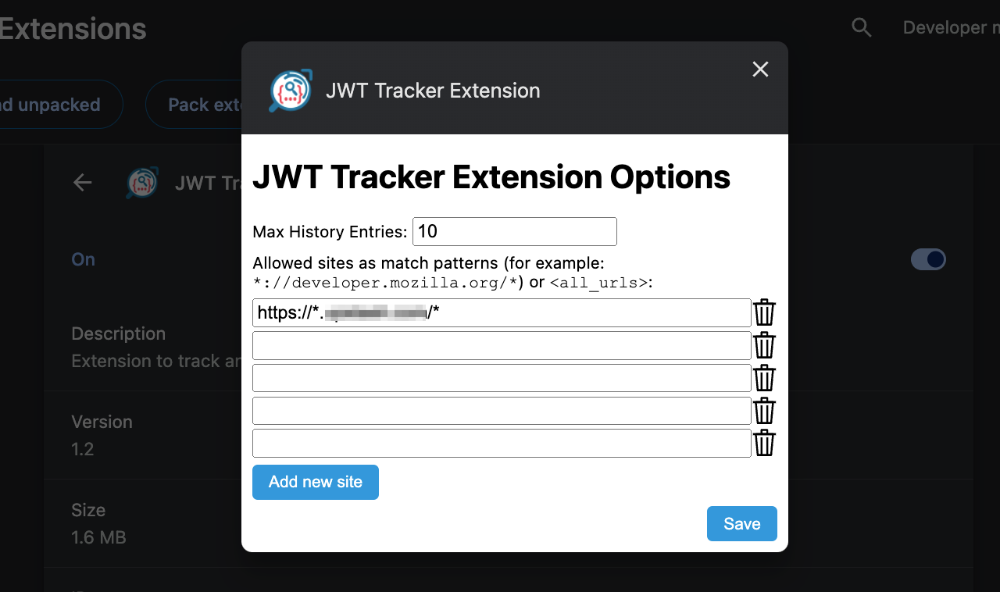
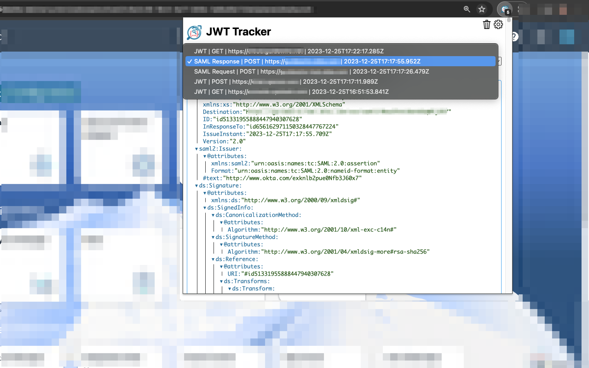

# JWT Tracker
Chrome and Firefox extension to track and show JWT and SAML data intercepted from web requests.

This extensions tracks any request with `Authorization: Bearer` header, `SAMLRequest` and `SAMLResponse` form body and stores them temporarly in your browser's local storage. 

It will exclusively monitor web requests originating from websites that you have specifically permitted through the options. You can grant permission by employing a matching pattern or by granting access to all websites using the special `<all_urls>` string.

Also, in options you can specify how many requests from different `initiator`s can be stored (default is `10`) per each tab in browser. 

In the popup, you have the option to either filter tokens based on their element paths or search for specific values.

## Changes

### Version 1.3
Bug fixes for Firefox

### Version 1.2
Support for Firefox was added. Extension does not need extensive host permissions anymore - instead user will be able to specify websites to monitor in options window. Additional `activeTab` permission is needed to get the url of the current tab when extension is opened. 

### Version 1.1
Bug fixes.

### Version 1.0
First version of an extension.

# Privacy Declaration for JWT Tracker Extension

## No Data Collection
I hereby declare that JWT Tracker does not collect, store, use, or share any personal data, browsing history, or any other information from its users. This extension operates locally on your device, and no data is transmitted to external servers or third parties.

## User Data and Permissions
The permissions required by JWT Tracker are solely for the functionality of the extension and do not enable me to access your personal data. I ensure that no unnecessary permissions are requested.

## Updates to Privacy Declaration
I may update this Privacy Declaration occasionally. Any changes will be posted on this page with an updated revision date.

## Effective Date
This Privacy Declaration is effective as of 2023-11-24.

